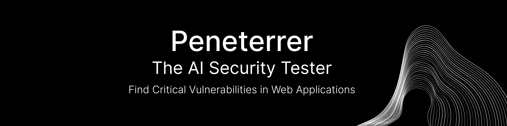
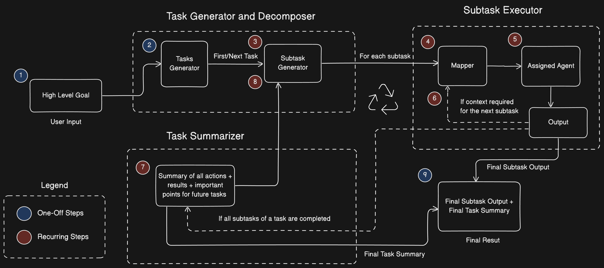

<div align="center">


[](https://peneterrer.com)
[](https://x.com/intent/follow?screen_name=peneterrer67022)
[](https://www.linkedin.com/company/106689673)

</div>


<div align="center" style="border-radius: 5px; margin: 20px 0;">
  <strong>Important:</strong> This is just an architecture release. If you would like to see this as a framework, help us reach 1k stars and we will put the effort to make it a developer friendly, general purpose framework to develop Agentic Systems
</div>

# Trees 🌳

**Trees** is a multi-agent orchestration framework that eliminates hierarchical LLM structures (like managers or team leads), enabling rapid development of production-grade AI systems capable of completing tasks fully autonomously.

*Fewer bugs, faster development, easier maintenance, and no more endless LLM loops.*

> Peneterrer's production agentic system is also powered by **Trees**. It conducts fully autonomous security tests without human intervention by mimicking penetration testers to find vulnerabilities.

## Architecture

Before diving into the architecture, let’s define what a **Task**, **Subtask**, and a **Tree** are.

### What is a Subtask?

Subtasks are small goals or "to-dos" that can be completed in a single shot by LLMs. They are atomic, independent, and designed to be as simple as possible to ensure maximum accuracy and minimal failure. A subtask is structured as follows:

```python
from dataclasses import dataclass
from typing import Literal

@dataclass
class Subtask:
    title: str
    description: str
    context: bool  # Whether to use the result of the previous subtask
    input: str
    agent: Literal["agent_name"]  # Custom agent assigned to this subtask
    output: str
```

### What is a Task?

Tasks are higher-level goals and are interdependent to each other. These are executed in sequence to fulfill the user’s overall query. A task is structured like this:

```python
from typing import List

@dataclass
class Task:
    title: str
    description: str
    subtasks: List[Subtask]
    summary: str
```

### What is a Tree?

A Tree represents the complete workflow of tasks required to accomplish an end goal autonomously. Its structure looks like this:

```python
@dataclass
class Tree:
    tree: List[Task]
```

Multiple Trees can be spawned - hence the name Trees - to execute highly complex operations, with each Tree focusing on a different part of the overall procedure.

### How Does It Work?



1. **High-Level Goal**: This is the user-defined objective to be automated. It can range from simple research tasks to complex operations like security testing (which at Peneterrer are supported by additional systems).

2. **Task Generator**: This component receives the user's goal and breaks it into several interdependent high-level tasks, forming a roadmap for subsequent subtask generation.

3. **Subtask Generator**: Subtasks aren't generated all at once. Instead, they are created sequentially. The first task is picked, and its subtasks are generated and assigned to agents.

4. **Mapper**: This intermediary layer executes the agent with appropriate context and input, depending on whether the subtask requires the output of a previous one.

5. **Assigned Agent**: Each subtask is handled by a specific agent. The agent's input - determined by the mapper - may include contextual information or just the subtask title and description. Agents are selected automatically based on suitability and have access to custom tools for tasks like web browsing, social media interaction, or computer use.

6. **Output (Context Step)**: If a subsequent subtask needs the previous output, and its context flag is set to `true`, the system provides the necessary information.

7. **Summarizer**: Once all subtasks within a task are completed, their outputs are summarized. This summary helps generate more accurate and relevant subtasks for the following tasks.

8. **Subtask Generation with Context**: When a task finishes execution, its summary and key outputs are passed along with the next task's details to the subtask generator. This ensures the new subtasks are aligned with previous results, enabling better coordination among agents.

9. **Final Output**: After all tasks and subtasks are completed and summarized, the final output includes the result of the last subtask and the final task summary. In most cases, this serves as the answer to the user’s original query or automation request.
